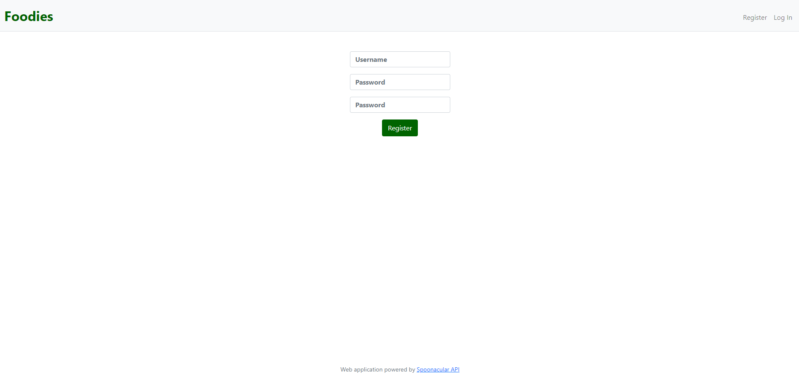
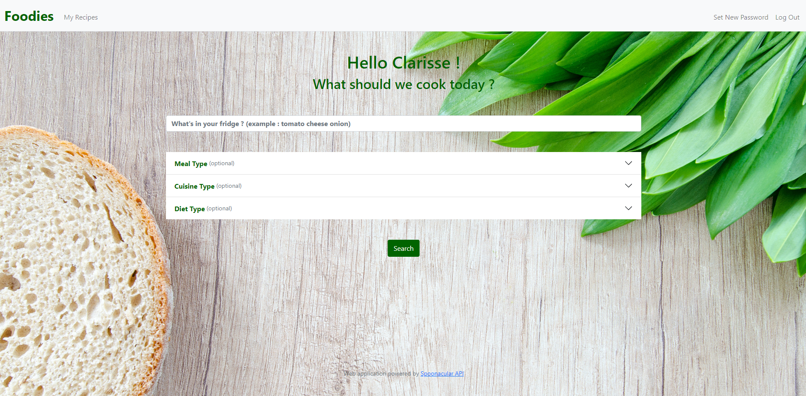
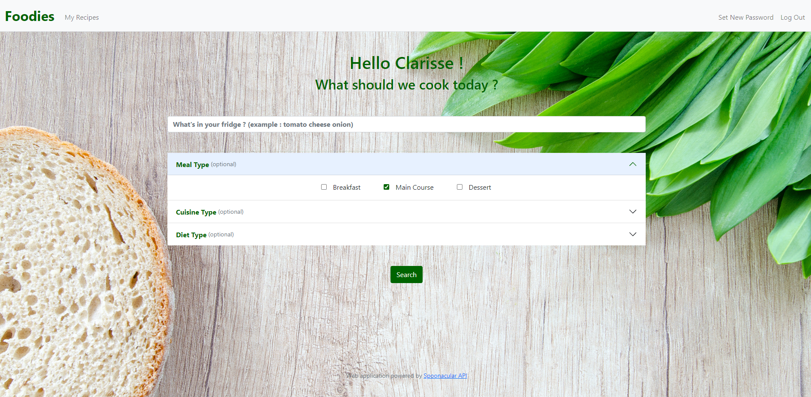
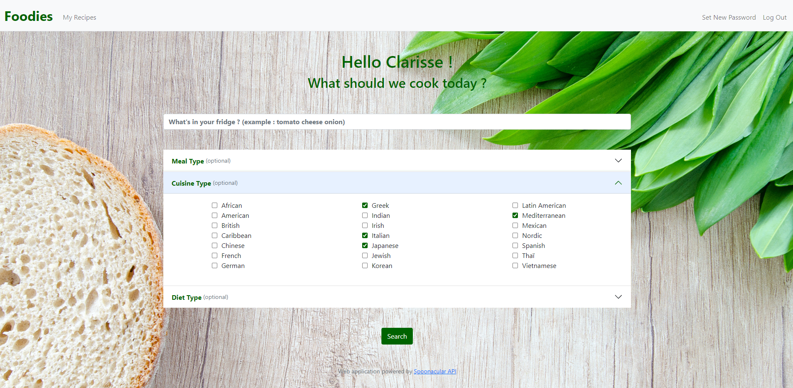
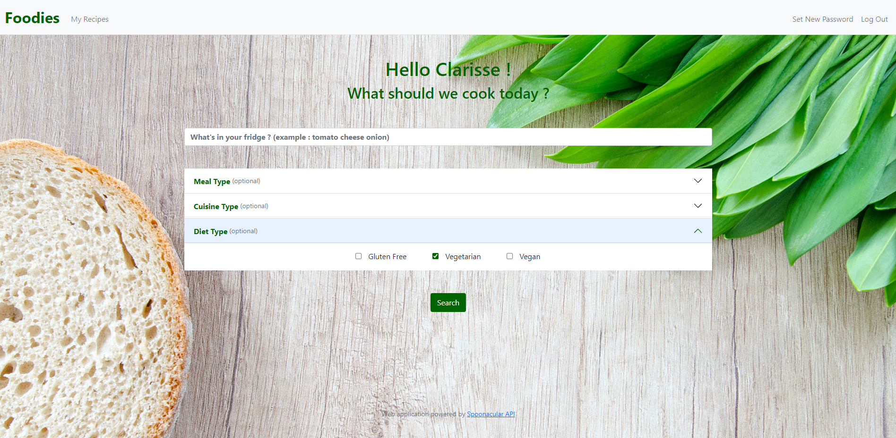
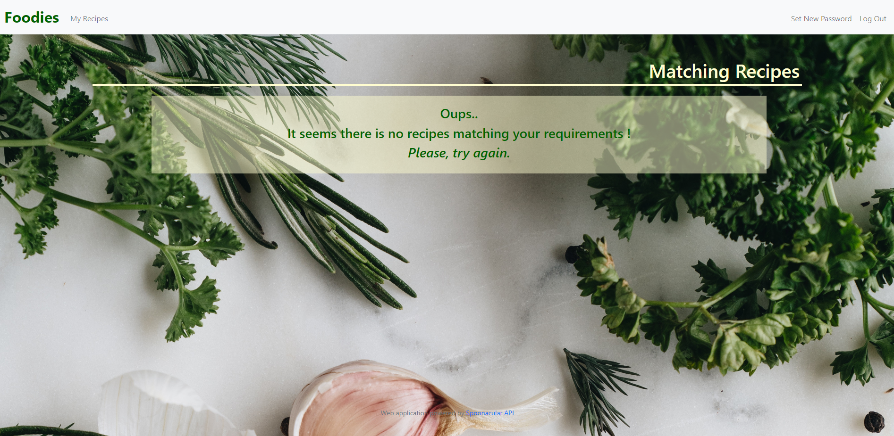
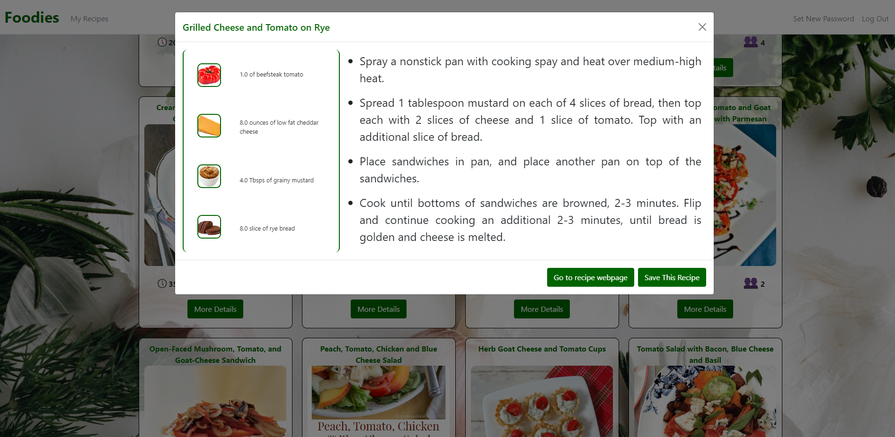
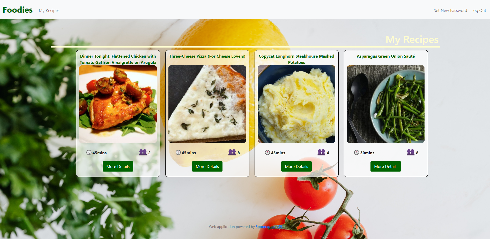

# FOODIES

#### Video Demo: https://www.youtube.com/watch?v=J_cNbZUDsBE

#### Description: FOODIES is a recipe search web application that allow user to find recipes base on specific ingredients, cuisine type and diet. All recipes are extracted from [Spoonacular API](https://spoonacular.com/food-api).

# Technologies


# Instructions

### Step 1

Clone this repository and install [python](https://www.python.org/downloads/) on your machine. Use the Download Python button that appears first on the page to download the latest version.

### Step 2

Then, run the following command to create a new virtual environment:

```
python -m venv venv
```

### Step 3

After creating the virtual environment, we need to activate it. To activate the virtual environment, run the following command in the terminal:

```
venv\Scripts\activate
```

### Step 4

Then, install flask

```
pip install flask
```

### Step 7

You will need to sing up to [spoonacular](https://rapidapi.com/spoonacular/api/recipe-food-nutrition/) in order to get an API KEY.
Once you get your own key, just fill the api_key variable line 27 of app.py file:

```
26  # SET API_KEY HERE
27  api_key = "SET API_KEY HERE"
```

### Step 6

In the project directory, run the following script:

```
flask run
```

# Features

## Register Page



In order to access website user have to register by providing a username and a confirmed password. Both username and password are stored into a database.

## Login Page


Once registered, user will have to login and must provide username and password matching with database.

## Index Page



When accessing main page, username is display to welcome user.

User must provide one or more ingredients in the text field. If not a flash notification will ask user to prompt for a query. Some checklists are available for more specific searches such as meal type, cuisine type and diet type. Inputs will be process on the back-end side and a response from the API as JSON data will be receive.

- ### Text Input

User must provide at least one ingredient or query to get to results page. Otherwise, user will get a flash notification asking them to provide input.

- ### Checklists

Some checklists are available to get more precise results. There is three subdivisions checklists as describe below.

1. #### Meal Type

   - Breakfast
   - Main Course
   - Desserts

   

2. #### Cuisine Type

   - African
   - American
   - British
   - Caribbean
   - Chinese
   - French
   - German
   - Greek
   - Indian
   - Irish
   - Italian
   - Japanese
   - Jewish
   - Korean
   - Latin American
   - Mediterranean
   - Mexican
   - Nordic
   - Spanish
   - Thaï
   - Vietnamese

   

3. #### Diet Type

   - Gluten Free
   - Vegetarian
   - Vegan

   

## Recipes Result Page


Recipes that match user's requirements will display in the result page. User can see recipe's name, a descriptive image, an approximate cooking time and servings.



If there is no recipes matching user requirements then a message will be display asking user to try again.

## Modal



[Bootstrap's modal](https://getbootstrap.com/docs/5.0/components/modal/) is used to show more information of the recipes such as ingredients and steps to follow.

From modal's recipe, user can either go to the recipe's source page or choose to save the recipe. In that case "My Recipes" page will be loaded displaying all saved recipes and a flash notification that the recipe has been saved will appear.

If current recipe is already saved then user will get a flash notifiaction and will stay on results page.

## Save Recipes



User's saved recipes will be display into "My Recipes" tab. From this tab, user will have access to the same informations that were display from results page. User can easily remove any recipes from modal button.


Until user save his first recipe, a message will be display.

## Set New Password


From "Set New Password" tab, users can set new password. Old password must be provide and new password have to be confirm twice to be accepted. In case of wrong inputs, users will get a flash notification.

# Credit

**[CS50x](https://pll.harvard.edu/course/cs50-introduction-computer-science?delta=0)**<br>
**[David J. Malan](https://cs.harvard.edu/malan/)**<br>
**[Brian Yu](https://brianyu.me/)**<br>
**[Doug Lloyd](https://hls.harvard.edu/doug-lloyd/)**<br>

